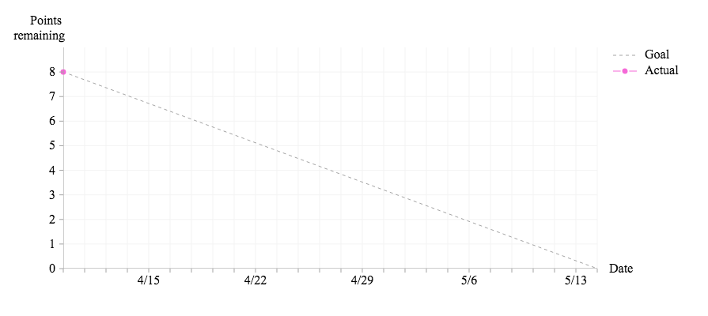
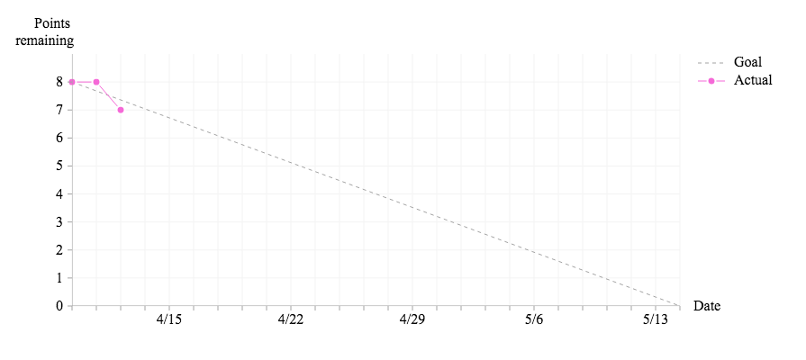
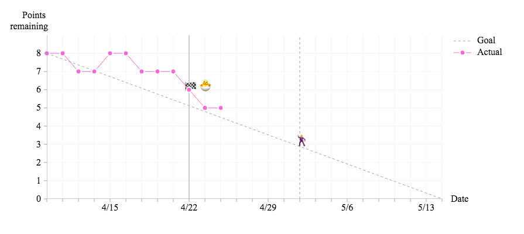

[](https://travis-ci.org/avh4/burndown-charts)
[](https://package.elm-lang.org/packages/avh4/burndown-charts/latest/
)

This is an Elm package that makes it easy to create [burndown charts](https://en.wikipedia.org/wiki/Burn_down_chart).
It is built on top of [`terezka/line-charts`](https://package.elm-lang.org/packages/terezka/line-charts/latest/) -- thanks, terezka!


## Step by step

You'll need the following dependencies added to your Elm project (`elm/time` is needed to specify `Month` values):

```sh
elm install avh4/burndown-charts
elm install elm/time
```

To create your burndown chart, you'll need the following info about your project:

- The **name of the project**. Put this in the `title` field.
- The **start date of the project**.  Put this in the `startDate` and `baseline` fields.
- The **number of story points in scope** for the project.  Put this in the `pointsRemaining` field.
- One of the following:
    - The **estimated velocity** of your team.  Put this in the `baseline` field with `BurndownChart.scopeBased`.
    - The **target release date of the project**.  Put this in the `baseline` field with `BurndownChart.timeBased`.

*Code example: Today is April 9th, the project is starting with 8 points in the backlog, and there is a target release date of May 14th.*

```elm
import BurndownChart
import Time exposing (Month(..))

main : Html msg
main =
    BurndownChart.view
        { name = ""
        , color = Nothing
        , startDate = (2019, Apr, 9)
        , baseline =
            ( (2019, Apr, 9)
            , BurndownChart.targetDate (2019, May, 14)
            )
        , milestones = []
        , pointsRemaining = [ 8 ]
        }
```




### Updating the chart

At the start of each day, append the current number of points remaining to the `pointsRemaining` list.

*Code example: On the second day of the project there were still 8 points remaining; during that day one point was accepted, so the following day started with 7 points remaining.*

```elm
    BurndownChart.view
        { ...
        , pointsRemaining = [ 8, 8, 7 ]
        }
```




### Milestones (optional)

You can have your chart show intermediate milestones by listing them in the `milestones` field.  Each milestone is a tuple containing:

- the name of the milestone.  (Consider using a single-character emoji for brevity!)
- the number of points that will remain in the project after the milestone is completed.
- the date the milestone was accepted, or `Nothing` if it has not yet been accepted.

*Code example: Two intermediate milestones are now being tracked.  (It's also now April 24th and `pointsRemaining` has also been updated.)  The "🐣" milestone was accepted on April 22nd, and the "🕺" milestone is not yet complete.*

```elm
    BurndownChart.view
        { ...
        , milestones =
            [ ( "🐣", 6, Just ( 2019, Apr, 22 ) )
            , ( "🕺", 3, Nothing )
            ]
        }
```


